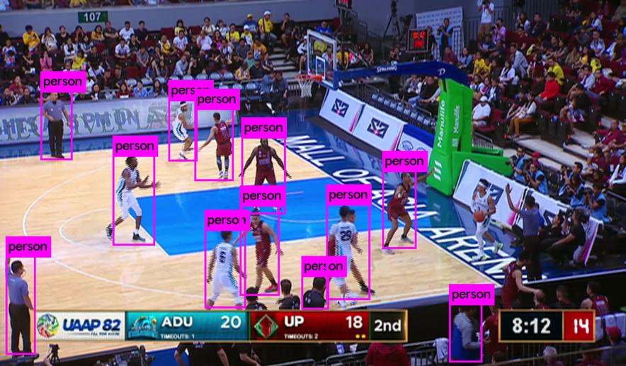
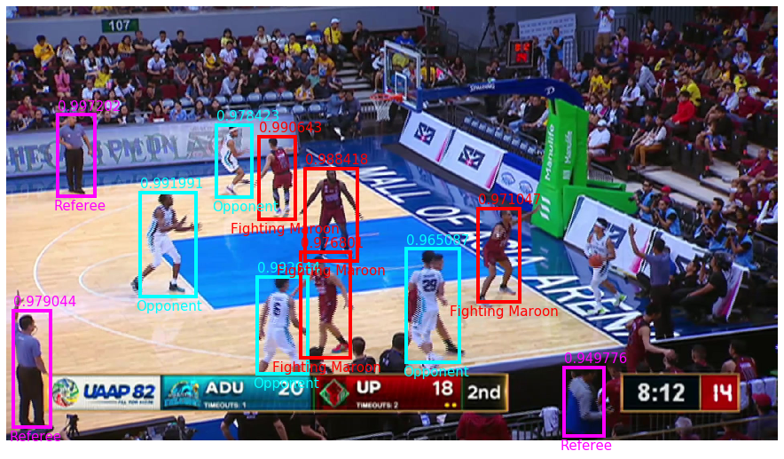
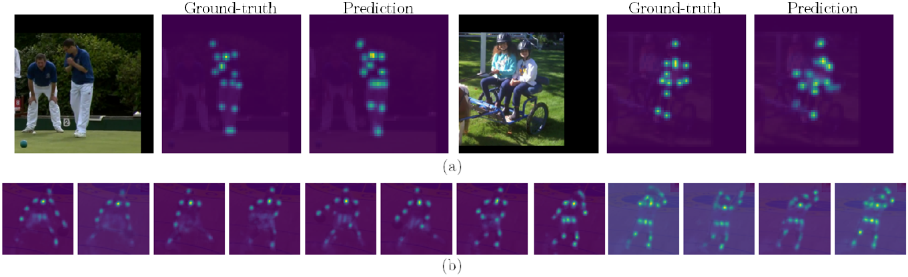

# Pose Estimation and Action Recognition of Basketball Players using Machine Learning Techniques
In this thesis, three different machine learning frameworks were implemented for object detection, pose estimation, and action recognition. For now, these frameworks were implemented in the hopes that they could be used for a joint pipeline that would perform detection then posed-based recognition consecutively. Still, the ultimate goal is a unified framework that could do all these things together, and better :weary::ok_hand:. 

Main References

* Player Detection
  * [YOLO v1](https://ieeexplore.ieee.org/document/7780460)
  * [YOLO v2](https://arxiv.org/abs/1612.08242)
  * [YOLO v3](https://arxiv.org/abs/1804.02767)

* Pose Estimation
  * [Stacked Hourglass Networks for Human Pose Estimation](https://link.springer.com/chapter/10.1007%2F978-3-319-46484-8_29)

* Action Recognition
  * [2D/3D Pose Estimation and Action Recognition Using Multitask Deep Learning](https://ieeexplore.ieee.org/document/8578637)
  * [Curve Spreads: A Biometric from Front-view Gait Video](https://www.sciencedirect.com/science/article/abs/pii/S0167865504001217?via%3Dihub)

## Player Detection

### Requirements (on Windows)

* **[Microsoft Visual Studio 2017/2019](https://visualstudio.microsoft.com/)**
* **[CMake](https://cmake.org/download/) >= 3.12**
* **OpenCV >= 2.4** ([This](https://www.learnopencv.com/install-opencv-4-on-windows/) installation guide helped me big time)
* **GPU with Compute Capability >= 3.0**
* **[CUDA](https://developer.nvidia.com/cuda-downloads) >= 10.0**
* **[cuDNN](https://developer.nvidia.com/cudnn) >= 7.0** (Note that you have to make an account to be able to download it, and follow the installation guide [here](https://docs.nvidia.com/deeplearning/cudnn/install-guide/index.html#install-windows))

Clone this [repo](https://github.com/AlexeyAB/darknet) and compile YOLO from source. A more exhaustive documentation is available in the said repo, including [instructions for compiling using `CMake`](https://github.com/AlexeyAB/darknet#how-to-compile-on-windows-using-cmake) and [instructions on using YOLO on the command line](https://github.com/AlexeyAB/darknet#how-to-use-on-the-command-line), which I pretty much used. Additionally, [this](https://medium.com/analytics-vidhya/installing-darknet-on-windows-462d84840e5a) may also help you.

### Some Details

Pre-trained weights of YOLOv3 from the COCO Dataset were used for player detection, and they are available [here](https://pjreddie.com/media/files/yolov3.weights) taken from Joseph Redmon's website (https://pjreddie.com/darknet/yolo/). Training YOLO from scratch would've taken so much time I'm not sure I would have made the deadline if I did. So, I opted to use these weights which, luckily, were robust enough to detect players on the court.

  
  

Here are some sample detections using the pre-trained weights. Raw detections are shown on the left, and after some image processing to classify detections to their teams on the right. It is worth noting that I used a crude thresholding for these classifications (Color histogram backprojection and area thresholding). One would have to use a better discriminator for robustness.

:exclamation::exclamation::exclamation: :fire:**YOLO v4**:fire: is available! Haven't tried it yet, but you might want to. :exclamation::exclamation::exclamation:

## Pose Estimation

For pose estimation, I used Stacked Hourglass Networks, and followed the [Keras implementation](https://github.com/yuanyuanli85/Stacked_Hourglass_Network_Keras) by Victor Li. The network was trained on the [MPII Human Pose Dataset](http://human-pose.mpi-inf.mpg.de/). You will have to download the dataset on your own and place it under `data/mpii/images`.

Below are some sample predictions from the test set of the MPII dataset, as well as a sequence of heatmaps of Klay Thompson shooting a jumpshot :basketball::sweat_drops:.

  

Now, say that you have the detections from YOLO. You may then proceed to getting the joint locations and estimated poses by cropping out the detections from the scene using the bounding box coordinates and feeding them into the stacked hourglass networks.

## Action Recognition

Then, from the estimated poses, I perform dimensionality reduction (taking inspiration from [curve spreads](https://www.sciencedirect.com/science/article/abs/pii/S0167865504001217?via%3Dihub)), where a time-sequence of poses is transformed into a compact 2D spatio-temporal representation which we would call *distance spreads* :see_no_evil:. Here, the joint distances from a defined body center are taken and stacked together as row vectors for each frame.

